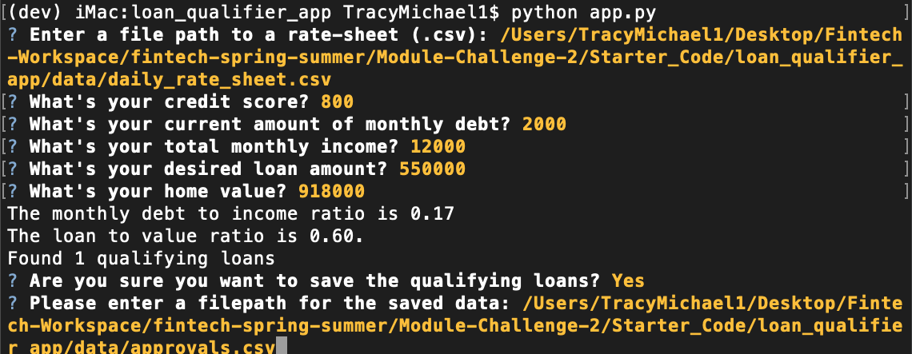

# Loan Qualifier App

This application is solely for the purpose of find qualifying loans for individuals.  

---

## Technologies


The Application has specific technologies that will be needed to run properly.


**Languages Required:** *Python*

**Libraries Required:** *Fire, Questionary, CSV, Sys, & PathLib*

Before running the application the following Libraries will need to be imported:

```python
import csv
import sys
import fire
import questionary
from pathlib import Path
```


Further details denoting requirements and verions are available in the requirements file.

[Requirements](./Starter_Code/loan_qualifier_app/requirements.txt)


---

## Installation Guide

This app will not work without the proper technologies listed above.  To ensure you have the applicable tools please install the requirements for the Loan Qualifying Application using the text file in the loan_qualifier_app folder as follows:

In The Terminal Run:

```python

pip install -r requirements.txt 

```


---

## Usage


### **For Coding Purposes:** Use the loan qualifier application from your terminal as follows:

Comment placements are listed above each section of the application.  Information can be used to explain each function and/or import within the application.

1. The application intially imports different modules that will be useful.

    -There are various files that used to filter the main loan list.

2. Functions are defined to filter the list based on the user information.  Explanations of each Library and/or Import is available in the comment section of the application. Some functions are directly connected to user input through the Command Line Interface (Questionary & Fire), while others have purposes that build the application from a different persepctive.

3. The sub files are used to filter the loan list, import/export csv files into the application, and/or calculate relative ratios or calculations.


### **For Users:** Use the loan qualifier application from your terminal as follows:

*In the terminal you will be prompted to answer or fill in the following questions or commands in the order listed below.  The provided information will ultimately provide a list of qualifying loans based on the user inputs:*

    1. Enter a file path to a rate-sheet
    2. What's your credit score?
    3. What's your current amount of monthly debt?
    4. What's your total monthly income?
    5. What's your desired loan amount?
    6. What's your home value?
    7. Enter a file path for saved data

**A display of the Terminal is below**




---

## Contributors

Tracy Davis <TracyMDavis88@gmail.com>

[Tracy Davis LinkedIn](https://www.linkedin.com/in/tracy-davis-mba-ma-2940a232/)

---

## License

MIT License

Copyright (c) [2022] [Tracy Davis]
